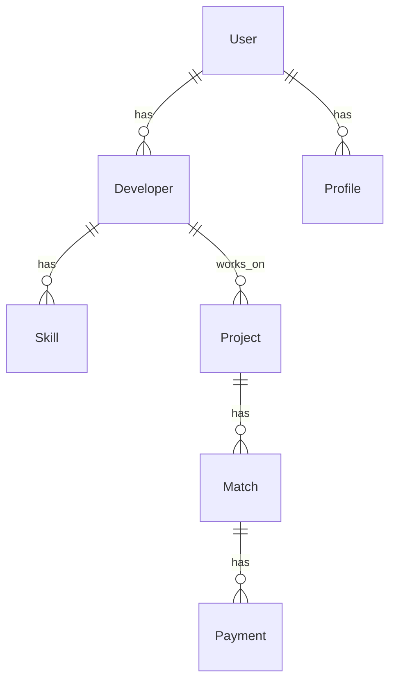

# Nominee Match 后端系统设计文档

## 1. 系统架构

### 1.1 整体架构
```
Backend (NestJS)
├── API Layer
│   ├── Controllers
│   ├── DTOs
│   └── Guards
├── Service Layer
│   ├── Business Logic
│   └── External Services
├── Data Layer
│   ├── Entities
│   ├── Repositories
│   └── Migrations
└── Infrastructure
    ├── Database
    ├── Cache
    └── Message Queue
```

### 1.2 模块划分
- 认证模块 (Auth)
- 开发者模块 (Developers)
- 匹配模块 (Matching)
- 支付模块 (Payments)
- 用户档案模块 (Profiles)

## 2. 数据库设计

### 2.1 实体关系


### 2.2 主要表结构
```sql
-- 用户表
CREATE TABLE users (
    id UUID PRIMARY KEY,
    email VARCHAR(255) UNIQUE NOT NULL,
    password_hash VARCHAR(255) NOT NULL,
    role VARCHAR(50) NOT NULL,
    created_at TIMESTAMP DEFAULT CURRENT_TIMESTAMP,
    updated_at TIMESTAMP DEFAULT CURRENT_TIMESTAMP
);

-- 开发者表
CREATE TABLE developers (
    id UUID PRIMARY KEY,
    user_id UUID REFERENCES users(id),
    title VARCHAR(255),
    bio TEXT,
    hourly_rate DECIMAL(10,2),
    created_at TIMESTAMP DEFAULT CURRENT_TIMESTAMP,
    updated_at TIMESTAMP DEFAULT CURRENT_TIMESTAMP
);

-- 技能表
CREATE TABLE skills (
    id UUID PRIMARY KEY,
    name VARCHAR(100) UNIQUE NOT NULL,
    category VARCHAR(100),
    created_at TIMESTAMP DEFAULT CURRENT_TIMESTAMP
);

-- 项目表
CREATE TABLE projects (
    id UUID PRIMARY KEY,
    title VARCHAR(255) NOT NULL,
    description TEXT,
    budget DECIMAL(10,2),
    status VARCHAR(50),
    created_at TIMESTAMP DEFAULT CURRENT_TIMESTAMP,
    updated_at TIMESTAMP DEFAULT CURRENT_TIMESTAMP
);

-- 匹配表
CREATE TABLE matches (
    id UUID PRIMARY KEY,
    developer_id UUID REFERENCES developers(id),
    project_id UUID REFERENCES projects(id),
    match_score DECIMAL(5,2),
    status VARCHAR(50),
    created_at TIMESTAMP DEFAULT CURRENT_TIMESTAMP,
    updated_at TIMESTAMP DEFAULT CURRENT_TIMESTAMP
);

-- 支付表
CREATE TABLE payments (
    id UUID PRIMARY KEY,
    match_id UUID REFERENCES matches(id),
    amount DECIMAL(10,2),
    status VARCHAR(50),
    created_at TIMESTAMP DEFAULT CURRENT_TIMESTAMP,
    updated_at TIMESTAMP DEFAULT CURRENT_TIMESTAMP
);
```

## 3. API设计

### 3.1 RESTful API规范
- 使用HTTP方法表示操作
- 使用复数名词表示资源
- 使用查询参数进行过滤和分页
- 使用HTTP状态码表示结果

### 3.2 主要API端点
```
# 认证
POST   /api/auth/register
POST   /api/auth/login
POST   /api/auth/logout

# 开发者
GET    /api/developers
POST   /api/developers
GET    /api/developers/:id
PUT    /api/developers/:id
DELETE /api/developers/:id

# 匹配
POST   /api/matches
GET    /api/matches
GET    /api/matches/:id
PUT    /api/matches/:id/status

# 支付
POST   /api/payments
GET    /api/payments
GET    /api/payments/:id
```

## 4. 安全设计

### 4.1 认证机制
- JWT token认证
- Token刷新机制
- 密码加密存储
- 会话管理

### 4.2 授权机制
- 基于角色的访问控制
- 资源级别的权限控制
- API访问限制

### 4.3 数据安全
- 数据加密传输
- 敏感数据加密存储
- 输入验证和清理
- XSS防护
- CSRF防护

## 5. 性能优化

### 5.1 数据库优化
- 索引优化
- 查询优化
- 连接池管理
- 缓存策略

### 5.2 应用优化
- 请求压缩
- 响应缓存
- 异步处理
- 负载均衡

## 6. 监控和日志

### 6.1 监控指标
- API响应时间
- 错误率
- 并发用户数
- 资源使用率

### 6.2 日志系统
- 访问日志
- 错误日志
- 性能日志
- 审计日志

## 7. 部署架构

### 7.1 开发环境
- 本地开发
- 开发服务器
- 测试数据库

### 7.2 生产环境
- 负载均衡器
- 应用服务器集群
- 数据库主从
- CDN加速

## 8. 扩展性设计

### 8.1 水平扩展
- 服务无状态化
- 数据库分片
- 缓存集群

### 8.2 垂直扩展
- 资源升级
- 性能优化
- 架构重构 